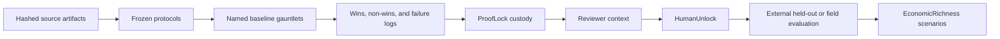

# Quant Hub Repo

**LumenCore evidence, benchmarking, and human-gated decision infrastructure**

This repository is the public technical record for LumenCore. It is organized for reviewers who need to distinguish implemented systems, synthetic tests, source-conditioned replay, prospective evaluation, and independent external validation.

It is not a product certification, patent claim chart, government endorsement, investment return record, or authorization for autonomous external action.

## Reviewer Snapshot

The current machine-readable snapshot is generated by [`BUILD_QUANT_HUB_REVIEWER_CONTEXT.py`](code/ops/BUILD_QUANT_HUB_REVIEWER_CONTEXT.py) and mirrored in [`quant_hub_reviewer_context_latest.json`](out/ops/quant_hub_reviewer_context_latest.json).

| Evidence surface | Current recorded result | Boundary |
|---|---:|---|
| Prior external proof packet | 156 of 156 copied artifacts hash-verified | Custody and reproducibility, not external validation |
| Public-safe estate index | 101,014 managed files; 58,220,081,958 bytes | Inventory metadata, not ownership, novelty, or value |
| Source measurement layers | 30 configured; continuity registry 25/29 measured with 2,580 rows; current probe 23/27 hash-backed measured with 2,377 rows | Inventory, continuity, and current-probe counts are separate; none is field validation |
| Locked source-conditioned replay | 404 routes; 2,861 baseline comparisons; 1,456 candidate wins; 1,405 losses or ties | Replay is conditional on its sources, metrics, and baselines |
| Frozen EIA residual holdout | Development-selected residual candidate; 1,176 holdout rows; Holm-positive against 6/6 internal baselines; full protocol gate closed | Minimum coverage is 90 vs. 150 days and the SWPP regression exceeds tolerance; no field, savings, or external-validation claim |
| Frozen EIA prospective router | 0 predictions; 0 settlements; waiting for first eligible forecast | Protocol is operational; prospective performance is not established |
| MDA synthetic feasibility v1 | 96 fixtures; candidate micro-F1 0.9167; promotion gate failed | Negative synthetic result preserved |
| MDA independent open-set v2 | 128 new fixtures; micro-F1 0.9434; supported coverage 0.9583; unsupported mapping rate 0; promotion gate failed | Safer unsupported behavior did not satisfy the superiority gate |
| FAA SDR frozen holdout | 10,000 unique reports; 80,000 model evaluations; hybrid macro-F1 0.142170 vs. 0.139775 strongest baseline; promotion gate failed | Public report-level maintenance triage only; no FAA, OEM, airworthiness, field, or savings claim |
| Funding-package reviewer scan | 44 Markdown files; 0 configured unsafe-claim hits; 0 configured secret hits | Packaging control, not scientific, legal, security, or funding approval |
| Portable reviewer replay | 3/3 suites and 31/31 assertions reproduced from a 14,704-row frozen public EIA panel plus deterministic MDA fixtures | Local bounded replay; GitHub clean-runner status is authoritative per commit and is not independent validation or agency certification |

These values describe the current artifact snapshot. Rebuild the reviewer context before citing them.

## Evidence Maturity

Quant Hub uses a claim-specific maturity scale:

| Level | Meaning | Minimum evidence |
|---:|---|---|
| 0 | Concept registered | Name, scope, owner, and prohibited claims |
| 1 | Implemented and tested | Runnable code, deterministic tests, and input contract |
| 2 | Frozen synthetic benchmark | Preregistered fixtures, split, baselines, metrics, and preserved failures |
| 3 | Source-conditioned replay | Hashed sources, reproducible replay, named baselines, wins and non-wins |
| 4 | Prospective public-data evaluation | Post-freeze observations, complete settlements, and preregistered gates |
| 5 | Independent external validation | Named external evaluator, held-out or field data, accepted metric, and dated receipt |

**Current repository-wide supported maturity: Level 3. Level 5 has not been attained.** The EIA lane targets Level 4 but is still waiting for eligible predictions and settlements.

Maturity is not a product-readiness, agency-approval, patent, security, or valuation grade.

## Platform Vocabulary

| Term | Bounded meaning |
|---|---|
| **LumenCore** | The technical platform and research program |
| **LumaTrader** | The quantitative-market experimentation and measurement lane |
| **NovaStack** | The orchestration and context layer connecting protocols, builders, dashboards, and gates |
| **ProofLock** | Hash, manifest, provenance, negative-result, and reproducibility controls |
| **HumanUnlock** | Required human decision before submissions, certifications, spending, account changes, external sends, legal actions, or live orders |
| **EconomicRichness** | Bounded economic scenarios built only after an external owner accepts the technical metric and assumptions |

The authoritative definitions and prohibited interpretations are in [`quant_hub_lexicon_v1.json`](config/quant_hub_lexicon_v1.json).

## What Is Supported

- Evidence-building infrastructure is implemented and tested.
- The locked replay records named baselines, positive comparisons, and non-wins.
- Failed MDA promotion gates are retained as falsification evidence rather than relabeled as success.
- The frozen FAA SDR holdout preserves a positive point delta that did not pass multiplicity-adjusted inference and therefore was not promoted.
- The EIA prospective protocol is frozen and operational, with a truthful zero-prediction waiting state in this snapshot.
- Proof packets use manifests and SHA-256 receipts that can be independently rechecked.
- External submissions and consequential actions remain human-gated.

## What Is Not Supported

This repository does not currently establish:

- independent field validation or Level 5 status;
- realized customer or government savings;
- production readiness or regulatory approval;
- universal model superiority;
- profitable live trading or fiduciary readiness;
- patent validity, claim scope, infringement, or freedom to operate;
- guaranteed funding, commercial value, or investment returns.

## Architecture



`HumanUnlock` is a control boundary. The repository does not authorize unattended submissions, certifications, spending, account changes, external communications, legal filings, or live orders.

## Reproduce The Reviewer Context

From the repository root:

```powershell
python code/ops/BUILD_QUANT_HUB_REVIEWER_CONTEXT.py
python -m pytest -q tests/test_quant_hub_reviewer_context.py tests/test_faa_sdr_source_audit.py tests/test_faa_sdr_10k_benchmark.py
python -m pytest -q tests/test_external_proof_vault.py tests/test_funding_sprint_reviewer_gate.py
```

The full locked replay is intentionally broader and may take several minutes:

```powershell
python -m pytest -q tests/test_locked_source_baseline_replay_sweep.py
```

## Clean-Room Reviewer Replay

The bounded reviewer capsule packages the frozen public EIA panel in deterministic gzip form, exact-pins the direct Python environment, emits a scoped CycloneDX dependency inventory, replays two measured EIA holdouts and one deterministic MDA falsification lane, and records every expected fact as a machine assertion.

```powershell
python -m pip install --requirement requirements-reviewer.txt
python code/ops/RUN_REVIEWER_REPRODUCIBILITY_CAPSULE.py --with-fixture-tests
```

The corresponding GitHub Actions workflow runs on a clean Ubuntu runner with read-only repository permissions and publishes the receipt, logs, SBOM, and SHA-256 checksum list as a workflow artifact. Start with [`REVIEWER_REPRODUCIBILITY_CAPSULE_2026-07-14.md`](docs/REVIEWER_REPRODUCIBILITY_CAPSULE_2026-07-14.md) and the frozen protocol in [`reviewer_reproducibility_protocol_v1.json`](config/reviewer_reproducibility_protocol_v1.json).

The protocol preserves two failed clean-runner attempts. The second passed 30/31 assertions and exposed a 0.4269% XGBoost CPU-platform MASE drift while preserving champion identity, coverage, comparison count, and gate outcomes. A disclosed post-observation amendment now allows at most 1% relative drift for that metric only; all structural and decision assertions remain exact, and each receipt keeps the exact measured value.

This capsule does not bundle the roughly 114 MB FAA SDR source corpus or the wider local/private source universe. Dependency versions are exact-pinned, but cross-platform wheel and source-distribution hashes are not yet fully locked. A green CI run is software reproducibility evidence, not independent scientific validation, security certification, agency approval, or field performance.

## Reviewer Path

1. Start with [`REVIEWER_START_HERE.md`](docs/REVIEWER_START_HERE.md).
2. Read [`QUANT_HUB_REVIEWER_CONTEXT_2026-07-13.md`](docs/QUANT_HUB_REVIEWER_CONTEXT_2026-07-13.md).
3. Rehash the source artifacts listed in its source chain.
4. Inspect the frozen FAA SDR benchmark and its failed promotion gate.
5. Inspect route-level wins and non-wins in the locked replay ledger.
6. Review the preserved MDA v1 and v2 failed gates.
7. Verify the EIA prospective status before making any forward-performance statement.
8. Define an external held-out dataset, acceptance metric, evaluator, and dated receipt before using Level 5 language.

## Repository Map

| Path | Purpose |
|---|---|
| `config/` | Frozen protocols, registries, claim rules, and vocabulary |
| `code/` | Benchmarks, routers, evidence builders, and operational controls |
| `tests/` | Deterministic checks for code, schemas, claim boundaries, and custody |
| `out/` | Machine-readable benchmark and operational outputs |
| `docs/` | Reviewer-facing reports and preregistrations |
| `dashboard/` | Read-only evidence and human-approval surfaces |
| `grant_submissions/` | Draft packages, source manifests, and human decision gates |

The bounded agent roles, verified language adapters, and five coordination cadences are defined in [`hybrid_agent_capability_registry_v1.json`](config/hybrid_agent_capability_registry_v1.json). They are operating controls, not claims of general intelligence or universal language expertise.

## Patent And Privacy Boundary

The public repository does not state what any filed patent claim covers. Patent counsel must compare the official filed claims and specification with dated technical evidence and later-developed concepts.

Private patent records, credentials, personal identifiers, and privileged communications are excluded from public builders and proof packets. Public artifacts may expose only bounded, public-safe metadata.

## Stewardship

LumenCore is developed by Robert Ashworth as an independent technical research program. The review standard here is deliberately plain: measure what can be measured, preserve what fails, identify what remains unknown, and require a human decision before consequences leave the system.
