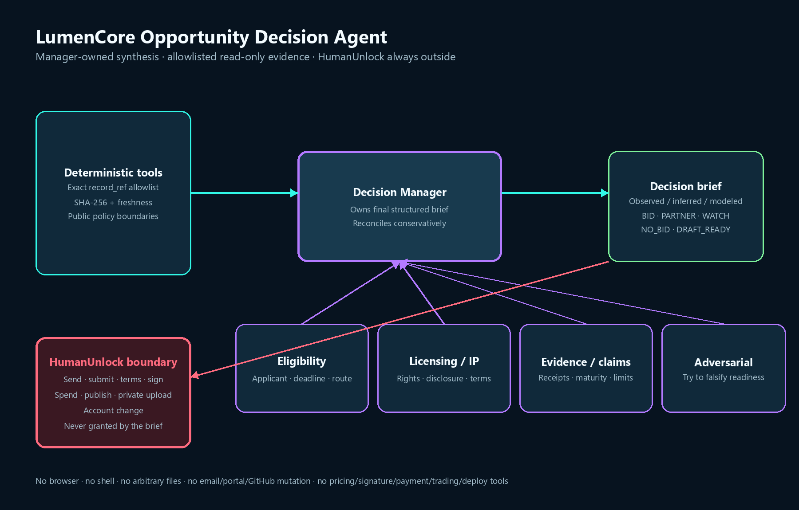
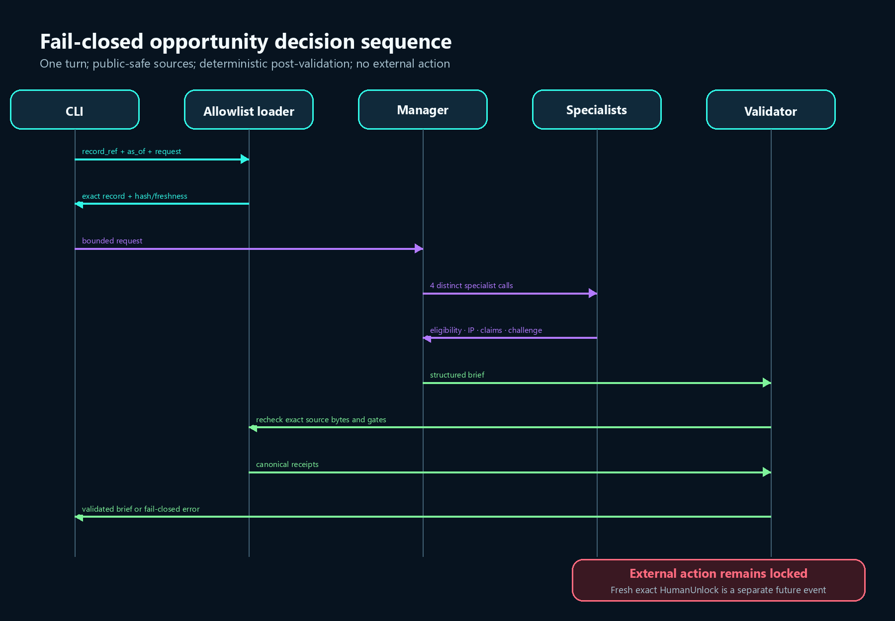

# LumenCore Opportunity Decision Agent

This is a bounded, public-safe OpenAI Agents SDK decision slice for active
founder outcome 2: convert one qualified opportunity into one evidence-bound
Buyer-Owned Baseline Validation Sprint or a justified no-bid/watch decision.
It is not a new product, dashboard, crawler, lead generator, submission engine,
or replacement opportunity control plane.

The manager retains ownership of one strict `OpportunityDecisionBrief` and may
call four distinct specialists as tools:

- grant or contract eligibility;
- licensing and founder-IP boundary;
- evidence and claim verification;
- adversarial readiness review.

Every runtime capability is read-only and limited to the records and evidence
paths in `config/source_registry.json`. There is no browser, shell, arbitrary
file, email, portal, GitHub, pricing, signature, terms, account, payment,
trading, deployment, or production tool. A brief can prepare local drafts. It
cannot perform or authorize an external action.

## Architecture





## Local setup

From this directory on Windows PowerShell:

```powershell
python -m venv .venv
.venv\Scripts\python -m pip install -e .
```

The app uses `OPENAI_API_KEY` from the process environment for live mode. It
does not print, persist, or inspect the key value. Tracing is disabled in this
runtime so opportunity inputs are not copied into an Agents SDK trace.

## Offline, no-network proof

```powershell
.venv\Scripts\python -m lumencore_opportunity_agent.main `
  --offline `
  --record-ref fixture:draft-ready `
  --as-of-utc 2026-08-30T18:00:00Z `
  --request "Assess this record and prepare local draft-only next steps."
```

List the exact allowlisted record references:

```powershell
.venv\Scripts\python -m lumencore_opportunity_agent.main --list-records
```

## Live manager-owned run

```powershell
.venv\Scripts\python -m lumencore_opportunity_agent.main `
  --record-ref deadline:NSF_26_510_20260727 `
  --as-of-utc 2026-08-30T18:00:00Z `
  --request "Assess only. Do not submit, send, sign, accept terms, or quote a price."
```

The default model is `gpt-5.6`; `--model` can select another model available to
the approved API project. Live output is validated again after the model run.
A stale source, absent eligibility proof, unknown/closed deadline, unknown IP
boundary, hallucinated source path, unsupported claim, or missing HumanUnlock
boundary fails closed.

A bounded public-safe smoke receipt is committed at
`docs/live-smoke-receipt.json`. It records runtime versions, the top-level run
count, validation result, and boundaries without storing raw output, hidden
reasoning, traces, or the API key value.

## Evals

The four required cases exercise the same public entrypoint and strict output
validator used by the CLI:

```powershell
.venv\Scripts\python evals/run_local.py --mode offline
.venv\Scripts\python evals/run_local.py --mode live
```

The cases cover a bounded draft-ready record, stale evidence, missing
eligibility, and a request to submit/send/accept price. Results are local-only
under `evals/results/`; the harness stores hashes and grades, not traces or API
credentials.

## Decision vocabulary

- `DRAFT_READY_HUMAN_REVIEW`: configured local-draft evidence gates are met;
  external action remains locked.
- `BID`: pursue only after named gaps are closed; not submission authority.
- `PARTNER`: a documented partner capability or authority is required.
- `WATCH`: official evidence is stale, missing, or unresolved.
- `NO_BID`: current evidence shows a closed deadline, ineligibility, or a
  decisive mismatch.

The output always separates observed, inferred, and modeled statements and
names exact repository source paths, hashes, freshness, eligibility/deadline/
evidence/claim/IP gaps, draft-only artifacts, and exact HumanUnlock actions.
It never treats a model recommendation as a win, award, validation, customer,
patent, savings, eligibility confirmation, submission, or contract receipt.
